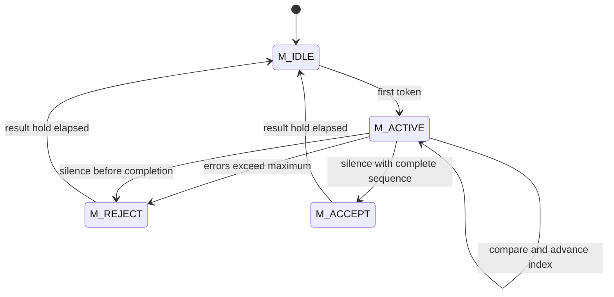
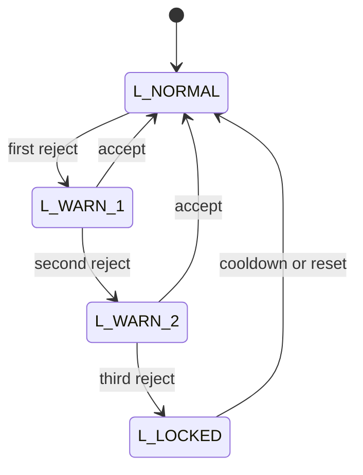

# State machines

## Matcher

```mermaid
stateDiagram-v2
  [*] --> M_IDLE
  M_IDLE --> M_ACTIVE: first token
  M_ACTIVE --> M_ACTIVE: compare and advance index
  M_ACTIVE --> M_REJECT: errors exceed maximum
  M_ACTIVE --> M_ACCEPT: silence with complete sequence
  M_ACTIVE --> M_REJECT: silence before completion
  M_ACCEPT --> M_IDLE: result hold elapsed
  M_REJECT --> M_IDLE: result hold elapsed
```

## Lockout

```mermaid
stateDiagram-v2
  [*] --> L_NORMAL
  L_NORMAL --> L_WARN_1: first reject
  L_WARN_1 --> L_WARN_2: second reject
  L_WARN_2 --> L_LOCKED: third reject
  L_WARN_1 --> L_NORMAL: accept
  L_WARN_2 --> L_NORMAL: accept
  L_LOCKED --> L_NORMAL: cooldown or reset
```

Count one failure per attempt. Ignore sensor input while locked. An accepted attempt clears the failure streak.